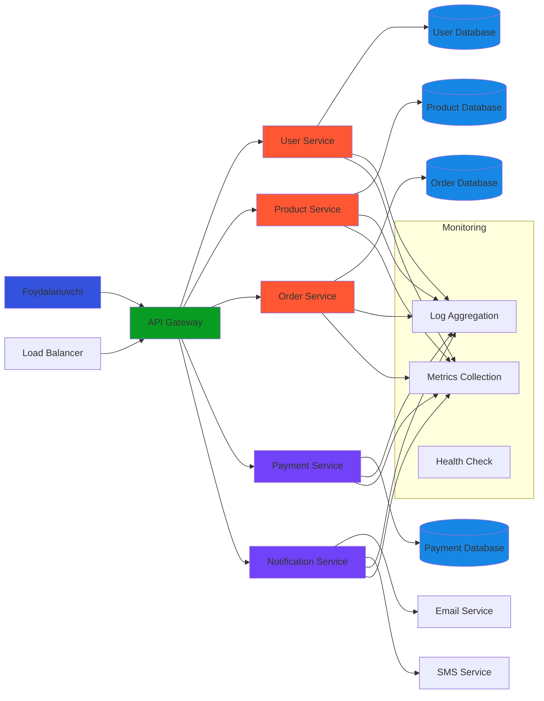

Microservice - bu katta dasturiy ta'minotni kichik, mustaqil xizmatlar (servislar) ga bo'lib, har birini alohida ishlab chiqish va deploy qilish imkonini beruvchi arxitektura uslubi.

## Microservice ishlatilishi:

**Katta kompaniyalar:**
- Netflix (video streaming)
- Amazon (e-commerce)
- Uber (transport xizmati)
- Spotify (musiqa streaming)
- Twitter (ijtimoiy tarmoq)

**Qo'llanilish sohalari:**
- E-commerce platformalari
- Banking va moliya tizimlari
- Ijtimoiy tarmoqlar
- Streaming xizmatlari
- IoT tizimlari
- Cloud-based ilovalar

## Asosiy afzaliklari:

**Texnik afzalliklar:**
- Har bir servis mustaqil ravishda ishlab chiqiladi
- Turli texnologiyalar ishlatish mumkin
- Xatoliklar bir servisda qoladi, boshqalarga ta'sir qilmaydi
- Yengil test qilish va debugging

**Biznes afzaliklari:**
- Tez ishlab chiqish va deploy qilish
- Kichik jamoalar bilan ishlash
- Faqat kerakli qismlarni yangilash
- Yuqori miqyoslilik (scalability)

**Monolithic vs Microservice:**
- Monolithic - barcha funksiyalar bitta ilovada
- Microservice - har bir funksiya alohida servisda

**Microservice uchun zarur texnologiyalar:**
- Containerization (Docker)
- Orchestration (Kubernetes)
- Service Discovery
- API Gateway
- Monitoring tools

**Qachon ishlatish kerak:**
- Katta jamoalar bilan ishlayotganingizda
- Tez o'zgarishlar talab qilinganida
- Yuqori load kutilganida
- Turli texnologiyalar kerak bo'lganida

**Qachon ishlatmaslik kerak:**
- Kichik loyihalarda
- Oddiy CRUD operatsiyalari uchun
- Jamoangiz microservice bilan ishlash tajribasiga ega emasligida

Microservice arxitekturasi zamonaviy katta ilovalar uchun eng yaxshi yechim hisoblanadi, lekin to'g'ri loyiha va jamoa uchun tanlanishi kerak.

## Microservice arxitekturasi


## Microservice Afzalliklari
```mermaid
graph LR
    A[Microservice Afzalliklari] --> B[Texnik Afzalliklar]
    A --> C[Biznes Afzalliklari]
    A --> D[Operatsion Afzalliklar]

    B --> B1[Mustaqil Development]
    B --> B2[Turli Texnologiyalar]
    B --> B3[Fault Isolation]
    B --> B4[Yengil Testing]

    C --> C1[Tez Deployment]
    C --> C2[Kichik Jamoalar]
    C --> C3[Qisman Yangilash]
    C --> C4[Market Time-to-Market]

    D --> D1[Scalability]
    D --> D2[Load Distribution]
    D --> D3[Resource Optimization]
    D --> D4[High Availability]

    subgraph "Texnik Tafsilotlar"
        E1[Java, Python, Node.js]
        E2[MySQL, MongoDB, Redis]
        E3[Docker, Kubernetes]
        E4[REST API, GraphQL]
    end

    B2 --> E1
    B2 --> E2
    B2 --> E3
    B2 --> E4

    subgraph "Qo'llanish Misolları"
        F1[Netflix: Video Processing]
        F2[Amazon: Product Catalog]
        F3[Uber: Ride Matching]
        F4[Spotify: Music Streaming]
    end

    C1 --> F1
    C1 --> F2
    C1 --> F3
    C1 --> F4

    style A fill:#0DA33F
    style B fill:#1787E5
    style C fill:#2196f3
    style D fill:#1787E5
    style B1 fill:#F08A07
    style B2 fill:#F08A07
    style B3 fill:#F08A07
    style B4 fill:#F08A07
    style C1 fill:#FF5733
    style C2 fill:#FF5733
    style C3 fill:#FF5733
    style C4 fill:#FF5733
    style D1 fill:#7142F7
    style D2 fill:#7142F7
    style D3 fill:#7142F7
    style D4 fill:#7142F7
  ```
